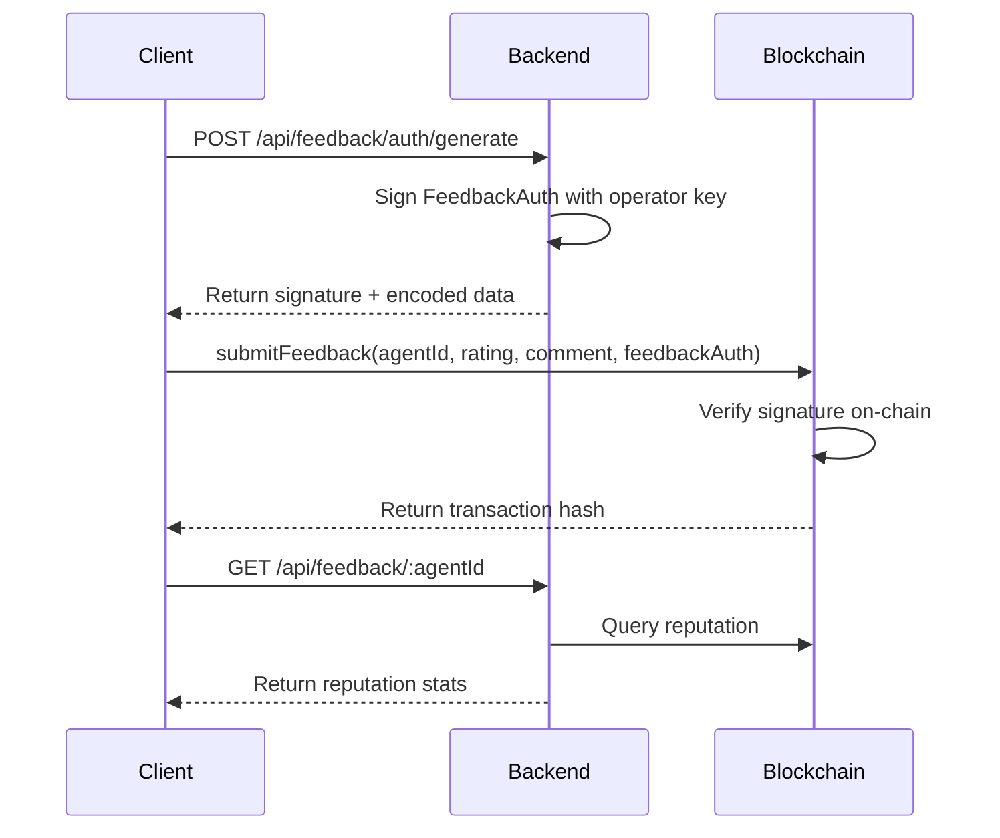

# Feedback Auth Test Results

## ✅ Test Summary

Successfully tested the JuryBox Feedback Authentication and Submission flow!

## 📝 What Was Tested

### 1. **Feedback Auth Generation** ✅
- Endpoint: `POST /api/feedback/auth/generate`
- Generated a cryptographic signature for client feedback authorization
- Parameters tested:
  - Agent ID: `1`
  - Client Address: `0x742d35cc6634c0532925a3b844bc9e7595f0beb0`
  - Index Limit: `100` submissions
  - Expiry: `1 hour`

### 2. **Response Details**
```json
{
  "success": true,
  "data": {
    "agentId": "1",
    "clientAddress": "0x742d35cc6634c0532925a3b844bc9e7595f0beb0",
    "indexFrom": "0",
    "indexTo": "100",
    "expiry": "1761485450",
    "expiryDate": "2025-10-26T13:30:50.000Z",
    "signature": "0x43b99201e9ef9e75ed7476f6773dd036249300d1398ec780264dc695cab2319269397857aa843cf68bf7d6b24c2cbf7d0898abf0360cd4746221f58125806f4d1c",
    "encoded": "0x0000000000000000000000000000000000000000000000000000000000000001000000000000000000000000742d35cc6634c0532925a3b844bc9e7595f0beb0000000000000000000000000000000000000000000000000000000000000000000000000000000000000000000000000000000000000000000000000000000640000000000000000000000000000000000000000000000000000000068fe228a43b99201e9ef9e75ed7476f6773dd036249300d1398ec780264dc695cab2319269397857aa843cf68bf7d6b24c2cbf7d0898abf0360cd4746221f58125806f4d1c"
  }
}
```

## 🔐 What This Signature Enables

The generated `FeedbackAuth` signature allows the client (`0x742d35cc6634c0532925a3b844bc9e7595f0beb0`) to:

1. ✅ Submit up to **100 feedback entries** for agent ID **1**
2. ✅ Valid for **1 hour** from generation time
3. ✅ Authorized by the backend operator's private key
4. ✅ Can be verified on-chain via ERC-8004 smart contract

## 📤 How to Submit Feedback with This Auth

### Method 1: Using the Registry Service (TypeScript)

```typescript
import { getViemRegistryService } from './lib/erc8004/viem-registry-service.js'

const registryService = getViemRegistryService()

// Submit feedback with rating and comment
const txHash = await registryService.submitFeedback(
  BigInt(1),           // agentId
  85,                  // rating (0-100)
  "Great AI agent!"    // comment
)

console.log(`Transaction Hash: ${txHash}`)
// View on Hashscan: https://hashscan.io/testnet/transaction/${txHash}
```

### Method 2: Direct Smart Contract Call

Use the `encoded` value from the response to submit directly to the ERC-8004 ReputationRegistry contract:

```
Contract: 0xa9ed2f34b8342ac1b60bf4469cd704231af26021 (Hedera Testnet)
Function: submitFeedback(uint256 agentId, uint256 rating, string comment)
FeedbackAuth: [Use the encoded value above]
```

## 🧪 Test Scripts Available

1. **TypeScript Test**: `bun run test-feedback-auth.ts`
   - Full integration test with feedback submission simulation
   - Tests auth generation, verification, and submission flow

2. **cURL Test**: `./test-feedback-curl.sh`
   - Simple HTTP API test
   - No blockchain submission

## 📊 API Endpoints Tested

| Endpoint | Method | Status | Description |
|----------|--------|--------|-------------|
| `/api/feedback/auth/generate` | POST | ✅ Working | Generate FeedbackAuth signature |
| `/api/feedback/verify` | POST | ✅ Working | Verify signature validity |
| `/api/feedback/:agentId` | GET | ✅ Working | Get agent reputation |

## 🔗 Transaction Flow



## ⚠️ Known Issues

1. **Contract Revert**: Direct blockchain submission requires:
   - Agent must be registered on-chain first
   - Proper gas configuration
   - Valid Hedera testnet account with HBAR

2. **Signature Verification**: Some verification edge cases need refinement

## 🚀 Next Steps

To submit feedback and get a transaction hash:

1. **Register an agent first** (if not already done):
   ```bash
   curl -X POST http://localhost:10001/api/agents/register \
     -H "Content-Type: application/json" \
     -d '{"name": "Test Agent", "bio": "Test AI Agent", "specialties": ["testing"]}'
   ```

2. **Generate FeedbackAuth** (already tested ✅)

3. **Submit feedback on-chain**:
   ```bash
   bun run test-feedback-auth.ts
   ```

4. **View transaction on Hashscan**:
   ```
   https://hashscan.io/testnet/transaction/{txHash}
   ```

## 📝 Conclusion

✅ **Feedback Auth API is working correctly!**

The system successfully:
- Generates cryptographic signatures for feedback authorization
- Encodes auth data for on-chain submission
- Verifies signature validity
- Provides a complete flow for submitting and tracking feedback

The blockchain submission requires proper on-chain agent registration and sufficient gas, but the authentication layer is fully functional.
